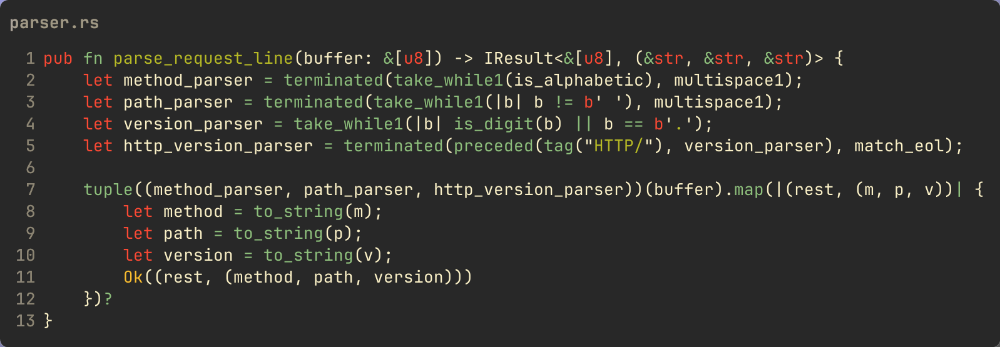
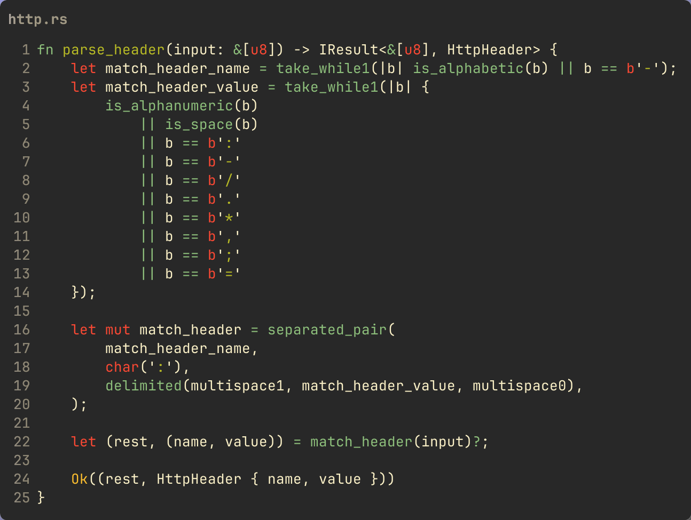

As soon as you want to do anything non-trivial with respect to parsing
text using Rust (or any language) you should use some kind of parser...

## Text parsing in Rust with Nom

As soon as you want to do anything non-trivial with respect to parsing
text using Rust (or any language) you should use some kind of parser
implementation. Writing a working parser for anything but the most
trivial content is non-trivial. Unless you want to learn parsers
(perhaps you're taking a compiler course), better to use an existing
tool/framework.

One approach is to use a parser generator, such as lex/flex or
yacc/bison. In this approach you write a grammar for what you want to
parse using the format those tools take, and they generate code that you
can then use to parse whatever it is you're parsing.

Another approach is to programmatically define your parser, and that's
where the [`nom`](https://github.com/rust-bakery/nom). Rust crate comes in. In a
sense you can think of `nom` as a
[DSL](https://en.wikipedia.org/wiki/Domain-specific_language) for writing
parsers. The crate contains
a bunch of functions that do very simple, specific things and you
combine and compose them to parse your text. You construct your parser
"bottom up" looking at the lowest level constructs and combining them to
build more complex items. Perhaps you need to match an encoded secret in
a configuration file, and these encoded passwords are of the form
`some_secret: {bcrypt}A87ADB6ADF` in which case you could use the `tag`
function in `nom`:

```rust
fn secret_parser(i: &str) -> IResult<&str, &str> {
  tag("{bcrypt}")(i)
}
```

which will strip off the `{bcrypt}`
prefix and return the rest of the input. Maybe your secret parser needs
to support two alternatives, `bcrypt` and
`custom` in which case you could modify
the above example to use the `alt`
function like so, to have two `alt`ernatives to match.

```rust
fn secret_parser(i: &str) -> IResult<&str, &str> {
    alt((tag("{bcrypt}"), tag("{custom}")))
}
```

Generally speaking, the `nom` functions
all have the same basic signature:

```rust
pub fn some_parser<T, Input, Error: ParseError<Input>>(
  tag: T,
) -> impl Fn(Input) -> IResult<Input, Input, Error>
```

They are essentially function generators, with the idea that you compose
them together to create more complex parsers ...

```rust
fn my_parser(input: &str) -> IResult<&str, MyType> {
    foo(bar(baz1, baz2))(input)?
}
```

## A Realistic Example

Rather than just showing some standalone snippets, let's create
something somewhat useful. Let's see how we could use
`nom` for parsing HTTP protocol messages,
or part of them anyway ... the request line and the headers. I'll leave
parsing the request body to you if you like.

> Of course there are crates out there to do this, so I wouldn't go down
> this route if I was trying to parse HTTP messages myself. Use
> something like the [`hyper`](https://docs.rs/hyper/latest/hyper/index.html)
> crate instead.

### HTTP Request Line

Let's start with the HTTP protocol's request line. Starting with the
HTTP [RFC 2616](https://www.rfc-editor.org/rfc/rfc2616) you can find what
constitutes valid messages including the [ABNF](https://en.wikipedia.org/wiki/Augmented_Backus%E2%80%93Naur_form)
grammar, which stands for Augmented [Backus-Naur Form](https://en.wikipedia.org/wiki/Backus%E2%80%93Naur_form).
If you've taken a compiler and/or theoretical computer science course you
probably came across BNF. RFC
2616 specifies the ABNF for the HTTP protocol, such as [basic
rules](https://www.rfc-editor.org/rfc/rfc2616#section-2.2) for what are valid
characters and tokens, what is a [valid HTTP version](https://www.rfc-editor.org/rfc/rfc2616#section-3.1)
and of course what is a valid protocol
[request line](https://www.rfc-editor.org/rfc/rfc2616#section-5.1).

In ABNF, a request line is defined as:

```text
Request-Line = Method SP Request-URI SP HTTP-Version CRLF
```

Each of the items to the right of the `=`
is required and is defined somewhere in the RFC. The `SP` and `CRLF` are defined
in the basic rules link I provided above, and are basically what you'd
guess. Then there's the `Method`,
`Request-URI` and
`HTTP-Version` which are specified in
their own subsections. These may further break down into ABNF
expressions. If you look at [`Request-URI`](https://www.rfc-editor.org/rfc/rfc2616#section-5.1.2)
you'll see it defined as

```text
Request-URI = "*" | absoluteURI | abs_path | authority
```

The pipe `|` symbol in ABNF signifies
logical "or" --- in other words the request URI has one of those parts.

Given this, what would the `nom`-based
parser look like? As with any code, there are several ways you could go
about writing this. The request line has three things we want to
extract, the HTTP method, the URI and the version. We don't care about
the separating white space or line terminator. And for the HTTP version,
we just want the version number itself. We know that it's HTTP after
all! I therefore organized my code into basically three parsers and I
return the parsed data as a tuple of
`(method, path, version)`. Also, since
there's more to parse after the request line, and given the way the
`nom` parser functions work, there's also
a "the rest of the input" return value that contains what has not been
parsed yet. So a function to parse the request line is:



Breaking this down, lines 2--5 define my `nom`-based parser functions. I
construct my domain-specific parsers building on the low level `nom`
constructs. In this case, looking at the `method_parser` function defined at
line 2, I use four different `nom` parsers:

- `terminated` --- this parser takes
  two parsers; the first one defines how to match the content I want
  to keep, and the second parser defines how to match what I want to
  discard.
- `take_while1` --- what I want to
  keep is defined by this parser. This parser takes a function
  defining what is valid to keep until some condition. In this case I
  want to keep alphabetic characters. This parser also shows a common
  pattern in the `nom` API which is the `1` at the end of the function.
  There are many functions that have a `1` or a `0` at the
  end, signifying there should be "one or more" or "zero or more" of
  the specific thing, similar to the `?` and `*` regular
  expression characters.
- `is_alphabetic` --- this parser
  does exactly what it says: returns true while the input is an
  alphabetic character.
- `multispace1` --- this parser
  defines what the terminated parser should discard. In this case it
  should consume and discard one or more spaces. This takes care of
  the space after the method.

Putting that all together I have a variable
`method_parser` that's a
`Fn` that takes a `&[u8]` and returns an `IResult<&[u8], &[u8]>` where the
first value in the tuple is the "rest" of the
input that wasn't consumed, and the second value is the matched HTTP
method bytes. If there was an error, the result has an
`Err(ParseError)` from `nom`.

> One thing I'm going to skip over in this post for brevity is the
> different APIs `nom` has for
> "complete" or "streaming" inputs. For example, the
> `take_while1` function is
> `nom::bytes::complete::take_while1` but there is also a
> `nom::bytes::streaming::take_while1` and the difference manifests in the errors
> generated if the input "runs out" while parsing. You can read the docs
> for details.

Assuming a valid request line then, the result of calling
`method_parser(b"GET /foo HTTP/1.1")` is
`(b"GET", b"/foo HTTP/1.1")`.

The next parser, that `path_parser`
simply looks for anything that isn't a space, to define what is valid,
and then uses the `multispace1` function
again to define the terminator. Finally the
`http_version_parser` looks for the
`tag` of `HTTP/` and drops it, while keeping the content that is matched
by `version_parser`. This uses the
`nom` function `preceeded` which as you can probably tell is the opposite of the
`terminated` function we've already seen.
The `terminated` parser keeps the content
of the first parser argument and drops the content of the second while
the `preceeded` parser drops the content
matched by the first parser and keeps the content matched by the second
parser. (There's also a `match_eol`
parser function which is something that I wrote; it's not from
`nom`. It just looks for
`tag("\r\n")` in the input. I broke it
out so I can re-use it elsewhere.)

Putting it all together I chain these parsers together using the
`tuple`parser from `nom` and finally converting the matched method, path and
version to `&str` values from the
`&[u8]` slices.

### HTTP Headers

After consuming the HTTP request line, the "rest" of the input should be
the HTTP headers. There are two types, request and response headers
(really three types since there are ["entity"
headers](https://www.rfc-editor.org/rfc/rfc2616#section-7)). As we're parsing
the request, I'm only
going to cover the request headers, which are defined [here in the
RFC](https://www.rfc-editor.org/rfc/rfc2616#section-5.3).

All headers ABNF syntax are defined [here in the
RFC](https://www.rfc-editor.org/rfc/rfc2616#section-4.2), but to summarize are
name/value pairs separated by a `:`. Here is the function I wrote using `nom`
to parse a single header:



You should be able to grok what's going on here given the earlier
example. What's new here is the `nom`
method `separated_pair` which takes three
parsers, the first and third defining the pair of things to keep, and
the middle one what to match to discard. In this case we're skipping
the `:` separator. The
`match_header` parser then will match one
header line. To match all the headers, just call this in a loop. The
HTTP headers section itself, when there are no more headers to read, is
indicated by double CRLF, that is `"\r\n\r\n"`. Following that is the request
body, but as I said at
the start I'm not going to get into that. Reading the body isn't really
about parsing, since it's opaque bytes, and all we know is what's
provided in the headers we just parsed.

### Conclusion

Hopefully this has given you a taste for what parsing with
`nom` is like. There is obviously a lot
more ... I didn't cover all the various parsers the crate provides. If
this intro whetted your appetite, go check out their docs. And as I also
mentioned at the start, there are multiple ways to write this example.
Please let me know if you've got a "better" or just different way. I'm a
beginner with `nom` just as I am with
Rust overall. I'm doing this to learn, and so if you have something to
share to help me learn, please share it!
