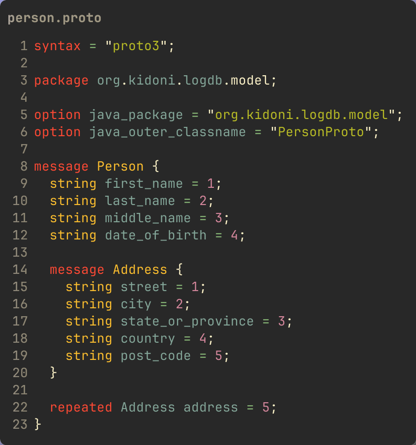
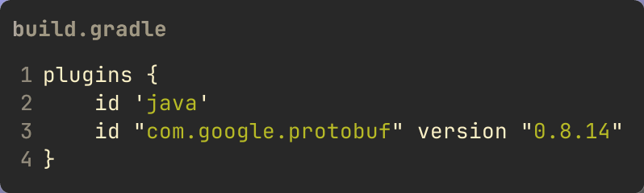
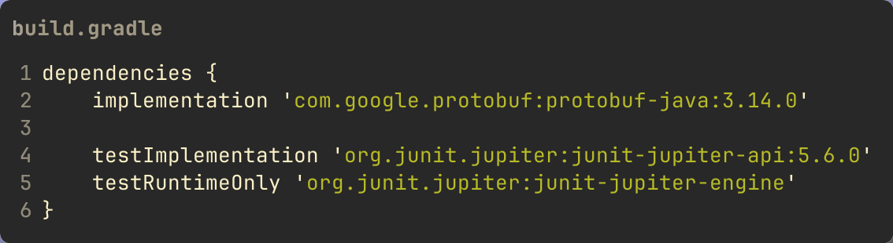
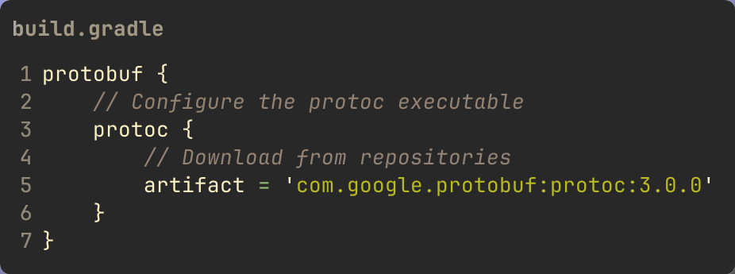
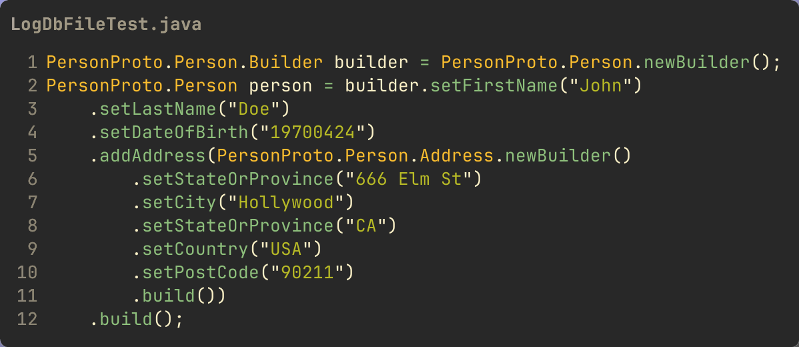
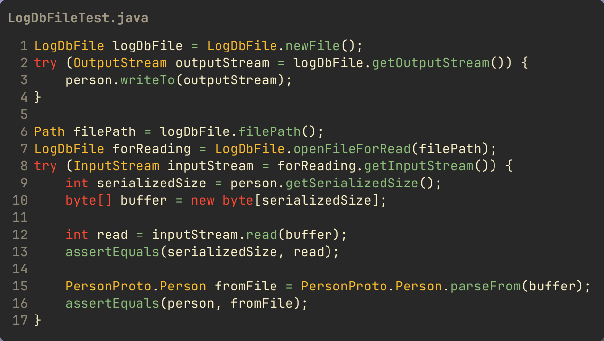

In my previous post about [Using off-heap memory in Java programs](Using-off-heap-memory-in-Java-programs)
I showed how to set up a memory-mapped file. Now that
we have a memory-mapped file, let's write something to the file. There
are different approaches to how to serialize Java objects obviously
including the built-in Java serialization. But in this post I'm going to
use [Protocol Buffers](https://developers.google.com/protocol-buffers) (AKA
protobuf) for serialization, because why not? It will also give an opportunity
to show how to automate the use of protobuf in your automated build using
[Gradle](https://gradle.org/).

Protocol Buffers are a recent incarnation of a technique that's been
around for a long time --- a mechanism for describing data in a
language- and platform-neutral form which can be used to generate code
for (de)serialization. Take [XDR](https://docs.oracle.com/cd/E18752_01/html/816-1435/xdrnts-1.html?source=post_page-----a1a7d2d08cd7---------------------------------------)
for example. This is very similar to protobuf and was used in the RPC
implementation originating with Sun in SunOS/Solaris (ah the good old days).
Just as you can use protobuf for (de)serialization even if you aren't using
Google's gRPC, you could use XDR for (de)serialization without Sun RPC.

There was also the CORBA (Common Object Request Broker Architecture) and
its IDL ([Interface Description Language](https://en.wikipedia.org/wiki/Interface_description_language)).
There are a lot of "IDLs" as the preceding link shows. And as for CORBA, there
was actually support in Java for CORBA as CORBA's heyday coincided with Java's
rise.

The main point is that what protofbuf is doing is nothing new. What goes
around comes around.

With protobuf you create a `.proto` file where you define "message" formats. For
this example we'll define a `Person` with some attributes including an `Address`.



Some things to note in this definition are

- `syntax` specifies the protobuf version
- there is both a `package` definition as well as an `option java_package`
  definition; protobuf is language-agnostic and the `package` definition is for
  its own namespacing, while the Java package specification is for the mapping
  to Java. I set them the same but that isn't required.
- the `option java_outer_classname` specifies what the code generator should use
  as the class containing the code it will generate for the subsequent `message`
  definitions.
- each type you want to define is a `message` with various fields, and each
  field must have a unique integer ordinal; the types of fields are language
  neutral and map to specific language types per a defined spec
- you can have repeated elements, as shown with the `repeated Address` field
- you can have nested definitions like with the `Address` message definition
  within the `Person` message; alternatively I could have specified `Address` in
  its own `.proto` file and used an `import` statement e.g. if I was going to
  use `Address` in multiple message definitions.

Given a `.proto` file as above a compiler is used to generate source code which
is then used in your own code. The protobuf compiler is called `protoc` and
you invoke it like any compiler, providing the `.proto` source file(s). But
obviously you want to have this automated in your build. With Gradle, there is a
[protobuf plugin](https://github.com/google/protobuf-gradle-plugin). It is
pretty straightforward to use in your Gradle build. A very nice convenient
feature of the plugin is that it can (optionally) download the `protoc`
compiler for you automatically, so you don't have to ensure it's
installed wherever your build is executing.

First, add the plugin:



Then add the protobuf library dependency:



Finally, configure the plugin to download `protoc` if you want that:



By default the plugin expects your `.proto` files to be in `src/main/proto` but
you can configure that as well as several other things (e.g. the location for
the generated sources). See the plugin documentation in the link provided.

Now how do you use the generated code? Protobuf uses a "builder" pattern
for constructing instances.



There are a few different methods that can then be used to serialize the
`Person` instance e.g.

```java
public byte[] toByteArray();
public void writeTo(final OutputStream output);
```

and a few others. As I integrated this with my `LogDbFile` example, I used the
`writeTo(OutputStream)` method, after enhancing my `LogDbFile` class to expose
an `OutputStream` (and an `InputStream`).



Since the idea with this `LogDb` is to simulate an append-only file, you can
either write (to the end) or read, so in this example I create a new file -
implicitly for writing as I have it right now - and I serialize to the
`OutputStream`. Then I open the same file for reading, allocating a buffer to
store the data read from the file, then deserialize using the generated
`Person.parseFrom(byte[])` method.

As you can see, it's pretty straightforward to use protobuf as a
serialization mechanism. One benefit of this over, say, Java native
serialization is that the serialized content is language-neutral. I
could write a C/C++ program or a Go program with the
same `.proto` file and read the data I
wrote using my `LogDbFile` example.
