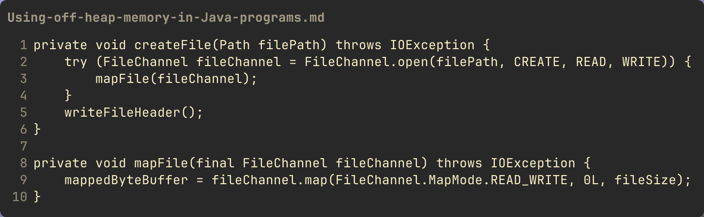
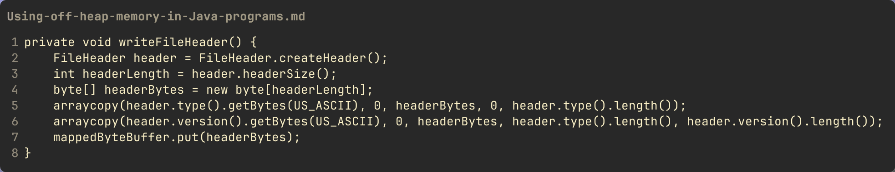
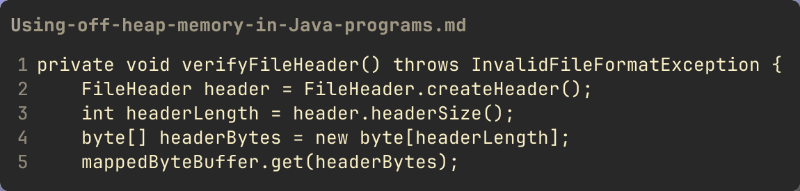

One of the nice things about modern programming languages is Garbage
Collection. As a developer you don't have to worry much about allocating
and freeing memory for your objects. With Java you just 'new' your class
and voila a new instance of the class. And when the instance is no
longer referenced, Java will take care of freeing the memory. When you
create objects this way, the JVM allocates memory from 'heap'
memory --- memory it manages for you.

So why would you want to do anything else?

In Java, the JVM allocates only so much heap space, when the JVM is
launched. How much heap is allocated can be controlled by command line
arguments:

```text
-Xms<size>        set initial Java heap size
-Xmx<size>        set maximum Java heap size
```

If you run out of heap, kaboom.

Also, depending on your use case, there could be performance reasons to
avoid the heap.

So how do you avoid the heap i.e. use "off-heap" memory? Java has
provided the java.nio package for quite a while now, and part of the
java.nio package is a Buffer interface and a Channel interface, with
various implementations like ByteBuffer and MappedByteBuffer and a
FileChannel and SocketChannel. I won't get into all the various things
you can do with the java.nio package here, but rather focus on the use
of off-heap memory.

To examine the use of off-heap memory, I will use an example of a "log
database", that is, an append-only immutable file-based "database". This
is how Kafka Topics are implemented, for example. I will use this
example to show using one approach to off-heap memory --- memory-mapped
files. The idea/capability of memory-mapped files has existed in
operating systems for a long time ... in \*nix systems, the
[`mmap`](https://man7.org/linux/man-pages/man2/mmap.2.html) system call has
existed for decades.

In Java, when you use memory-mapped files, you are directly accessing
the OS memory, bypassing the Java heap. This allows you to have possibly
very large amounts of memory accessible to you, limited only by the
amount of memory available to the OS.

To create a memory-mapped file in Java, you create a `FileChannel` and invoke
the `FileChannel.map()` method.



To create the channel you call `FileChannel.open()` as shown, providing the
location of the file as a `java.nio.file.Path` as a list of `StandardOpenOption`
enumeration values. Then calling `FileChannel.map()`e file you want to map into
memory. In this case I'm mapping the entire file. The `FileChannel` is not
required after mapping into memory, so I use the try-with-resource pattern to
ensure the channel gets closed.

Now you can read and write to this file via the `MappedByteBuffer` the file.



I have a `FileHeader` record (been experimenting with the new Java `record`
support) that contains a type and version. I convert this to a
`byte[]` and call the `MappedByteBuffer.put()` method. This
will write the bytes to position 0 in the mapped file, since as we saw
in the `FileChannel.map()` method I specified '0' as the starting position. The
`MappedByteBuffer` keeps track of the
last written position, so I can just keep writing to the buffer and the
offset is increased. You can manipulate the position e.g. if I wanted to
now read back the header I just wrote, I could call
`MappedByteBuffer.position(0)` and then call `get()`.



I hope this has given you a jump start in the use of off-heap memory in
Java.
