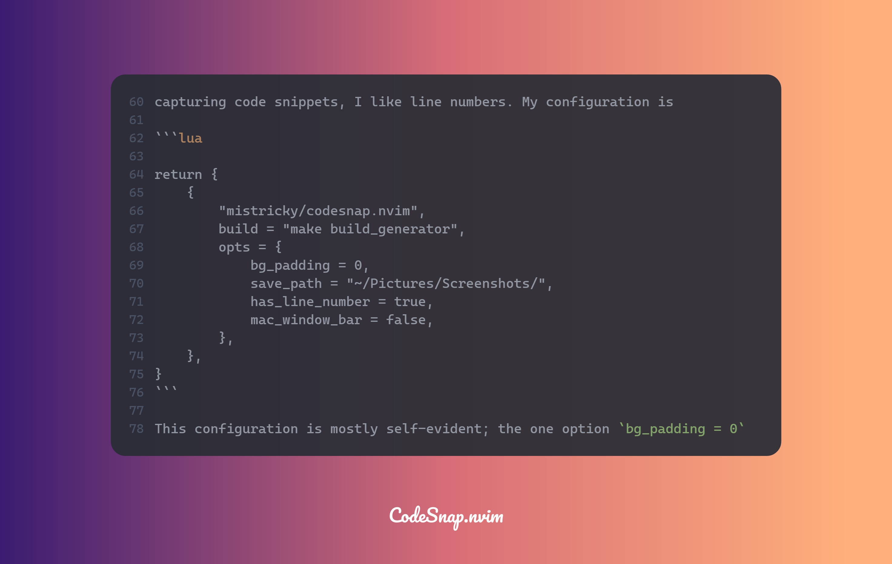
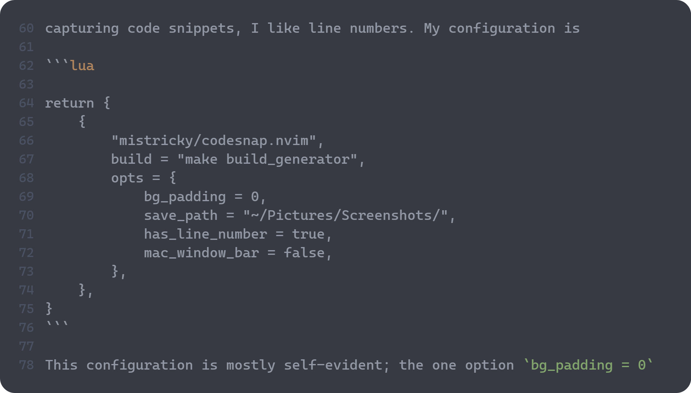

In a [previous blog](content/nvim-silicon-plugin.md) I discussed using
[nvim-silicon](https://github.com/michaelrommel/nvim-silicon) to capture a
screenshot of my Neovim buffer. At the time it felt like a good solution, and it
is still a viable and usable tool. Recently I have come across another solution
for creating a screenshot within Neovim. It is called
[CodeSnap](https://github.com/mistricky/codesnap.nvim). In this blog I will
briefly show how to use CodeSnap and discuss how it compares to Silicon.

## CodeSnap

> [!note] I cover only CodeSnap v1.0 here.

### Install

CodeSnap uses a Rust libary. As of v1.0 CodeSnap has a pre-built library for
some architectures. For others, you need to build from source so you will need
a Rust environment. The pre-built libary is available for

```text
x86_64-unknown-linux-gnu
x86_64-apple-darwin
aarch64-apple-darwin
```

I use Lazy to manage my plugins and configuration in Neovim, so to install
CodeSnap it's as simple as adding

```lua
return {
    {
        "mistricky/codesnap.nvim",
        build = "make build_generator",
    },
}
```

to e.g. `lua/plugins/codesnap.lua`. Even though CodeSnap does have the pre-built
library for a few architectures, the docs still recommend building from source.

### Configure

CodeSnap has several configuration options, including things like theme, font,
watermark, line numbers and of course key maps. Since my primary use case is to
capture content for my blog, I want a relatively minimalistic image, as compact
as possible without fancy borders or backgrounds and such. Since I'm also mostly
capturing code snippets, I like line numbers. My configuration is

```lua

return {
    {
        "mistricky/codesnap.nvim",
        build = "make build_generator",
        opts = {
            bg_padding = 0,
            save_path = "~/Pictures/Screenshots/",
            has_line_number = true,
            mac_window_bar = false,
        },
    },
}
```

This configuration is mostly self-evident; the one option `bg_padding = 0`
removes any background around the actual content. As such something like a theme
doesn't come into play. The following screenshots taken with CodeSnap, with and
without the `bg_padding` set, shows the difference.




The full set of configuration options can be found [here](https://github.com/mistricky/codesnap.nvim?tab=readme-ov-file#configuration).

### Features and Usage

CodeSnap supports the following commands:

```text
CodeSnap
CodeSnapASCII
CodeSnapSave
CodeSnapHighlight
CodeSnapHighlightSave
```

CodeSnap basically has two modes, saving to the clipboard and saving to a file.
The commands with `Save` in them save to a file, in the location specified in
the configuration `save_path`.

The commands with `Highlight` in them allow you to select lines to be highlighted
in the resulting screenshot. This is done by presenting a popup window in Neovim
where you select the lines you want to be highlighted in the resulting screenshot.

Finally the CodeSnapASCII is pretty unique I think, and captures an ASCII version
of a screenshot to the clipboard, with for example a border using ASCII characters
like to save to a text file.

> [!WARNING]
> Interestingly, when I used `CodeSnapASCII`, saved the resulting text to a
> file and then tried to get a screenshot of that text, CodeSnap paniced! Perhaps
> some ASCII character used to draw the border caused an issue? I don't know,
> and as of this writing I haven't submitted a bug or looked into it further. I
> wanted to show what the resulting captured ASCII looked like, but I guess this
> will be an exercise for the reader. Maybe it will be fixed when you read this
> and try it. Or it might be platform-specific (I'm on Ubuntu).

Both the clipboard and save-to-file commands work fine. One thing the docs note
is an [issue with Wayland](https://github.com/mistricky/codesnap.nvim?tab=readme-ov-file#copy-into-clipboard-on-linux-wayland)
if you're using the clipboard commands.

## Comparing CodeSnap and nvim-silicon

Right off the bat, one thing to note in comparing CodeSnap with nvim-silicon is
that the nvim-silicon plugin requires the `Silicon` tool to be installed. Not a
huge issue but it is a dependency. As dependencies go though, you might consider
that less of an issue than the CodeSnap dependency on having Rust available to
build the plugin, if you're not on one of the architectures for which there's the
pre-built CodeSnap libary.

| Feature                          | CodeSnap | nvim-silicon |
| -------------------------------- | -------- | ------------ |
| Save to file (1)                 | ✅       | ✅           |
| Save to clipboard                | ✅       | ✅           |
| Themes                           |          |              |
| Custom background image          |          |              |
| Fonts                            |          |              |
| Watermark                        | ✅       | ✅           |
| ASCII screenshot                 |          |              |
| Line numbers                     | ✅       | ✅ (2)       |
| Highlight lines (3)              | ✅       | ✅           |
| Code syntax highlighting         | ✅       | ✅           |
| File path breadcrumb             | ✅       |              |
| Custom breadcrumb path character | ✅       |              |

1. In CodeSnap the generated filename starts with `CodeSnap` and then has a timestamp.
   This makes it hard to know what the screenshot is without opening the file.
   In nvim-silicon, you can configure the generated filename. For example, I set
   it up to use the buffer name and then a timestamp:

   ```lua
            output = function()
                local vpath = vim.fn.expand("~") .. "/Pictures/Screenshots/"
                local buf_name = vim.api.nvim_buf_get_name(vim.api.nvim_get_current_buf())
                local fname = vim.fn.fnamemodify(buf_name, ":t")
                return vpath .. fname .. "-" .. os.date("!%Y%m%d-%H%M%S") .. ".png"
            end,

   ```

   I did not see a way to do that with CodeSnap. Trying to use the same function
   approach resulted in an error when I tried to generate a screenshot. Perhaps
   my lua-fu is not good enough.

2. By default, the line numbers from nvim-silicon start with 1, whereas the
   CodeSnap line numbers actually match the line numbers in the file that were captured.
   For nvim-silicon, you have to configure a function to return the real starting
   line number e.g.:

   ```lua
               line_offset = function(args)
                   return args.line1
               end,
   ```

3. Both CodeSnap and nvim-silicon support having specific lines highlighted in
   the resulting screenshot. The nvim-silicon approach is perhaps more "Neovim-esque"
   in that you use the Neivom mark capability with the 'mark highlight' command `mh`
   whereas as mentioned CodeSnap creates a popup buffer where you then use the visual
   select commands e.g. `v` or `shift-v`. Which you like better is a matter of taste.
