With all the wonderful graphical interfaces available, it's easy to forget that
a terminal is still a powerful tool. And depending on your job or what you're
doing, it can be the only interface available. Or you may just be longer in the
tooth like me and have been using terminal emulators or actual real-life
terminals for decades, and feel comfortable and at home working within a
terminal.

> [!note]
> I will use the term "terminal" from here on out, even though for almost
> everyone we're really using terminal emulators.

But even if you're used to using terminals, you may not have heard of some of
the newer tools available, which can seriously make you much more productive. So
whether you're relatively new to terminals or a seasoned pro, here are tools
for the terminal that have made me much more productive. Some of these are
replacements for tools you may be familiar with, and others are new(ish) and
make one wonder how we got along without them.

While terminal emulators themselves are important "terminal" applications in
and of themselves, I'm not going to cover them here. Perhaps in a future post I
will discuss terminal emulators, but for now, I'm going to focus on tools that
run within the terminals. Similarly I'm not going to cover shells, since I feel
that choice of shell is someone like a choice of IDE - it can be a very
religious discussion.

I've separated the tools into two categories:

- CLIs: tools that (for the most part) "just" output text to the terminal
- TUIs: tools that "take over" and render a user interface within the terminal

As you'll see some of the tools in the CLI set blur the lines between these two
categories. I'll calls those out when I describe them.

> [!info]
> Interestingly, a lot of these tools are written in Rust! Terminal applications
> are one of the sweet spots for Rust.

## CLIs

### eza

The [eza](https://github.com/eza-community/eza) tool is a replacement for `ls`.
Like many of the tools in this list, `eza` is aware of the modern terminal
ecosystem. It supports themes for the terminal output, is aware of Git, showing
Git file status in the output, and can be configured to show file sizes in
friendlier formats, among other things. For example,

```bash
$ eza --git
drwxr-xr-x    - ray 26 Jan 10:07 -I build
.rw-r--r--  274 ray 25 Jan 21:12 -M CMakeLists.txt
.rw------- 451k ray 25 Jan 21:34 -N core.3670938
.rw-r--r--   12 ray 25 Jan 11:08 -- in
.rw-r--r-- 2.0k ray 20 Jan 11:15 -- README.md
drwxr-xr-x    - ray 26 Jan 10:18 NM src
```

The next-to-last column displays the Git status of the file/directory. Note that
the `build` directory has an `I` indicating it is in the `.gitignore` file. To
have `eza` respect the `.gitignore` file, you can use the `--git-ignore` option.

Another "cool" and modern if somewhat frivolous feature is the ability to show
icons in the output listing.

```bash
$ eza --icons=always -1
 build
 CMakeLists.txt
 codecrafters.yml
 core.3670938
 in
󰂺 README.md
 src
```

Many of the options to `eza` match `ls` options, such as `-l` for a long listing,
or `-a` to show hidden files. But not all the options align. For example, to sort
a listing by timestamp, you would use the `-s` option with an argument of 'new'
or 'old', not `-tr` or `-t` respectively, which is arguably more intuitive, but
it is a difference.

As with a lot of the "replacement" commands in this list, I alias `eza` to `ls`:

```bash
alias ls='eza --git'
```

with the `--git` option to show Git status.

### fd

[fd](https://github.com/sharkdp/fd) is a replacement for `find`. It's faster and
arguably more powerful. If you're used to `find` and its command-line options,
you may have to adjust a bit, but it's fundamentally the same - searching for
files with various characteristics. Common use cases are much easier, and it is
aware of things like `.gitignore` files, excluding files in `.gitignore` by
default. You can also define a config file `~/.fdignore` for `fd` to specify
excludes that you want to always apply, such as

```bash
$ echo "/mnt/foo\n*.bak" > .fdignore
$ cat ~/.fdignore
/mnt/foo
*.bak
```

Unlike `find`, to find files you just specify the pattern you're looking for,

```bash
fd foo
```

which will look for files or directories with `foo` in the name, from the current
directory. By default it is case-insensitive, unlike `find`. You can look for
files with a given extension using the `-e` option. To find all Markdown files
in a given directory, you would use

```bash
fd -e md
```

Some things may take a little adjustment when you're used to `find`. For example,
expanding on the previous example, if you want to find all Markdown files in a
specific directory, you would use

```bash
$ fd . -e md SomeDirectory
# or $ fd -e md . SomeDirectory
```

In this case the `.` is not specifying the current directory but rather the
pattern to match, within the directory `SomeDirectory`.

This just scratches the surface of what `fd` can do. Look at the [GitHub page](https://github.com/sharkdp/fd)
for details and a demo.

### rg

The next new and powerful replacement tool is [rg](https://github.com/BurntSushi/ripgrep)
or `ripgrep`. This is a fast and powerful `grep` replacement. Somewhat similar
to the improvements that `fd` made in how to invoke the command, you don't need
to specify options for common things. By default, `rg` searches recursively
for all files for the current directory, case-insensitively. It will also respect
`.gitignore` and hidden files and directories, ignoring them by default.

To search for a pattern therefore is as simple as

```bash
$ rg main
<snip>

arch/mips/include/asm/octeon/cvmx-bootmem.h
52: * which is used to maintain the free memory list.  Since the bootloader is

crypto/nhpoly1305.c
9: * "NHPoly1305" is the main component of Adiantum hashing.
99:             if (state->nh_remaining == 0) {
103:                    state->nh_remaining = NH_MESSAGE_BYTES - bytes;
110:                    pos = NH_MESSAGE_BYTES - state->nh_remaining;
111:                    bytes = min(srclen, state->nh_remaining);
116:                    state->nh_remaining -= bytes;
118:            if (state->nh_remaining == 0)
150:    state->nh_remaining = 0;
210:    if (state->nh_remaining)

arch/mips/kernel/rtlx-mt.c
3: * License.  See the file "COPYING" in the main directory of this archive
<snip>
```

`rg` supports different character sets and can search in many compressed file
types. There is also a [configuration file](https://github.com/BurntSushi/ripgrep/blob/master/GUIDE.md#configuration-file)
`~/.ripgreprc` to customize its behavior.

### bat

[bat](https://github.com/sharkdp/bat) is a replacement for `cat` that adds
syntax-aware display of files, line numbers, themes, paging and more. You can of
course disable these options as desired, or set defaults. For example, setting
a theme can be done using the `BAT_THEME` environment variable. You can use a
predefined theme, or create your own. View available themes with `bat --list-themes`
which will show a snippet of code using each theme. You can also create your own.

Personally, I use the GitHub theme and I specify `less` as my pager. I also alias
`bat` to `cat`:

```bash
alias cat='bat'
export BAT_PAGER='ls -F'
export BAT_THEME=GitHub
```

An example of `bat` output (not with the GitHub theme):

```bash
$ cat .zshrc
───────┬────────────────────────────────────────────────────────────────────────
       │ File: .zshrc
───────┼────────────────────────────────────────────────────────────────────────
   1   │ # Add deno completions to search path
   2   │ if [[ ":$FPATH:" != *":$HOME/.zsh/completions:"* ]]; then export FPATH=
       │ "$HOME/.zsh/completions:$FPATH"; fi
   3   │
   4   │ # If you come from bash you might have to change your $PATH.
   5   │ # export PATH=$HOME/bin:/usr/local/bin:$PATH
   6   │ if command -v brew &>/dev/null; then
   7   │   eval "$(brew shellenv)"
   8   │ elif [ -e /home/linuxbrew/.linuxbrew/bin/brew ]; then
   9   │   eval "$(/home/linuxbrew/.linuxbrew/bin/brew shellenv)"
  10   │ else
  11   │   echo "can't find brew!"
  12   │ fi
  13   │
  14   │ ZSH_WEB_SEARCH_ENGINES=(
  15   │   rdoc "https://docs.rs/"
  16   │   crates "https://crates.io/search/?q="
  17   │ )
  18   │ #
  19   │ # Path to your oh-my-zsh installation.
  20   │ export ZSH="$HOME/.oh-my-zsh"
```

### fzf

One of the coolest command line tools is [fzf](https://github.com/junegunn/fzf),
a fuzzy finder with a UI. This is one of those tools that blurs the lines between
a CLI and a TUI. It provides a UI picker for files, directories, and command
output. It can display a "preview" of the currently selected item in the picker.
It integrates nicely with your shell, and is often embedded in other tools
(e.g. nvim).

> [!note]
> There is a related project [fzf-git](https://github.com/junegunn/fzf-git.sh)
> that provides shell integration allowing use of fzf with git.

fzf works well integrated with other tools. For example, you can use it with `fd`
and your shell to have fuzzy command completion. One thing you can do is combine
it with `ls` (or `eza`) to fuzzy find files or directories, with a preview:

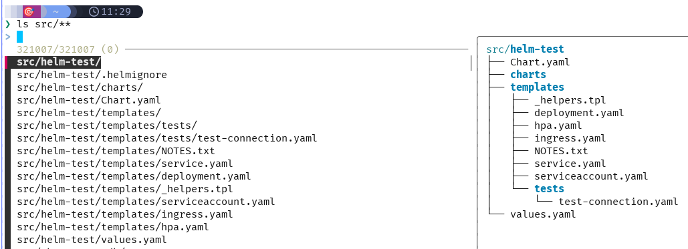

Or you can combine it with `ssh` and have it list hosts from your `/etc/hosts`
file, and showing a preview with `dig`:

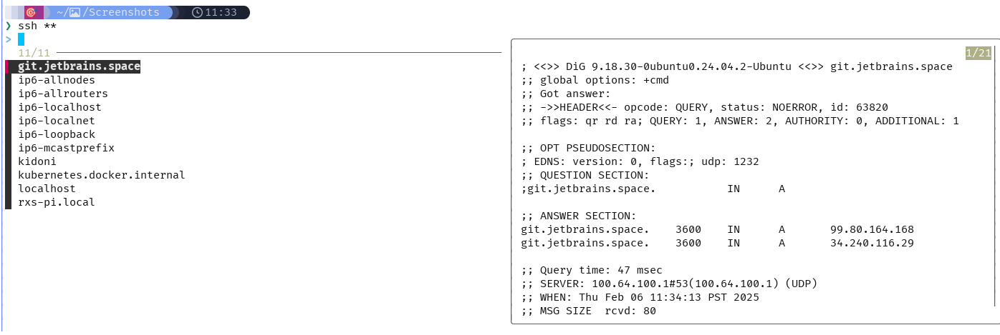

Here is my zsh configuration for `fzf` enabling the above functionality:

```bash
source <(fzf --zsh)

# -- Use fd instead of fzf --

export FZF_DEFAULT_COMMAND="fd --hidden --strip-cwd-prefix --exclude .git --exclude .obsidian"
export FZF_CTRL_T_COMMAND="$FZF_DEFAULT_COMMAND"
export FZF_ALT_C_COMMAND="fd --type=d --hidden --strip-cwd-prefix --exclude .git"

# Use fd (https://github.com/sharkdp/fd) for listing path candidates.
# - The first argument to the function ($1) is the base path to start traversal
# - See the source code (completion.{bash,zsh}) for the details.
_fzf_compgen_path() {
  fd --hidden --exclude .git . "$1"
}

# Use fd to generate the list for directory completion
_fzf_compgen_dir() {
  fd --type=d --hidden --exclude .git . "$1"
}

if [ -e ~/.fzf-git/fzf-git.sh ]; then
  source ~/.fzf-git/fzf-git.sh
fi

show_file_or_dir_preview="if [ -d {} ]; then eza --tree --color=always {} | head -200; else bat -n --color=always --line-range :500 {}; fi"

export FZF_CTRL_T_OPTS="--preview '$show_file_or_dir_preview'"
export FZF_ALT_C_OPTS="--preview 'eza --tree --color=always {} | head -200'"

# Advanced customization of fzf options via _fzf_comprun function
# - The first argument to the function is the name of the command.
# - You should make sure to pass the rest of the arguments to fzf.
_fzf_comprun() {
  local command=$1
  shift

  case "$command" in
    export|unset) fzf --preview "eval 'echo \${}'"          "$@" ;;
    ssh)          fzf --preview 'dig {}'                    "$@" ;;
    *)            fzf --preview "$show_file_or_dir_preview" "$@" ;;
  esac
}
```

There is so much more you can do! I'm just touching the surface. Check the
documentation. There are sites with various examples, but the [fzf docs](https://github.com/junegunn/fzf/wiki/examples)
have a lot of community-provided examples.

### atuin

Another tool that blurs the line between CLI and TUI is [atuin](https://github.com/atuinsh/atuin),
a command history fuzzy finder + database, that can also sync across your
systems. All your commands are saved to a database, and you can search through
that history to find what you're looking for. How many times have you typed
something like

```bash
history | grep kubectl
```

or some such hoping to find something you did some time in the past, but hopefully
not so long ago that it's aged out of your history file? And even if you did
find what you're looking for, you then have to copy/paste what you found. With
`autin` it's all from your terminal prompt, with fuzzy matching. Following the
search for `kubectl` example, and with a shell key mapping to launch `atuin` with
my up arrow key, I can do `$ kube<up-arrow>` and see:

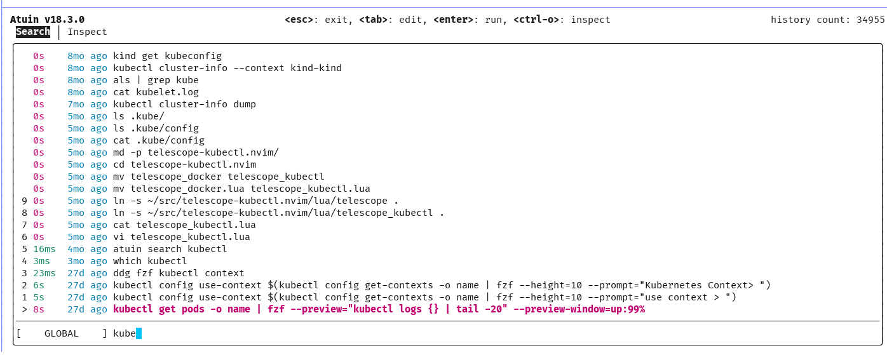

Note that "kube" is shown at the bottom, and if I keep typing, the list will
narrow down to what I'm looking for. I can then select the command I want, either
executing it with `<enter>` or giving myself the opportunity to edit it with
`<tab>`.

There's even a new "introspect" feature providing info on stats of the selected
command. I mean, it's a database after all.

As I mentioned, you can also have this database sync across machines, but that's
optional. It does require a free account on the `atuin` server.

Finally, after first installing `atuin` you can import your current command
history into the `autin` database with `atuin import`.

To set up `atuin` you just add this to your shell configuration, e.g. `.zshrc`:

```bash
# atuin configuration
if [ -e $HOME/.atuin/bin/env ]; then
  . "$HOME/.atuin/bin/env"
fi
eval "$(atuin init zsh)"
```

### zoxide

A nifty tool that helps you navigate your filesystem is [zoxide](https://github.com/ajeetdsouza/zoxide),
an alternative to `cd`. It uses a database to keep track of the directories you
change to, and then allows you to jump to those directories with a fuzzy search.

The command is `z` but I alias `cd` to `z`. You can then "cd" to some directory
from anywhere in your filesystem by providing just part of the directory name.

Zoxide depends on `fzf` for the fuzzy search, so you need to have `fzf` installed.
You can see fuzzy matches of your target directory, and then select the one you
want e.g. `$ z rust<sp><tab>`:

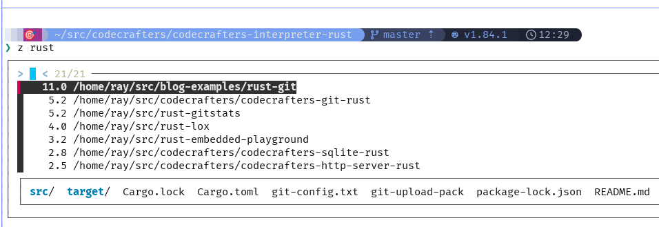

Shell integration is provided. For my `zsh` configuration I have:

```bash
eval "$(zoxide init zsh)"
alias cd=z
```

### dust

The [dust](https://github.com/bootandy/dust) tool can replace `du`. It provides
a faster and graphical view of disk usage.

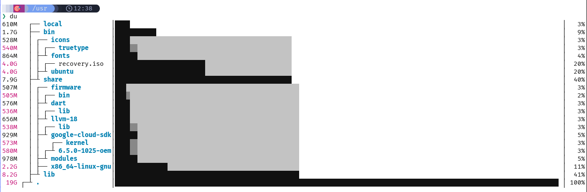

### curl replacements

Curl has been around forever, and is a great tool for making HTTP requests. But
it's not necessarily the most user-friendly tool. There are various tools that
try and address that. Two I want to call out are `curlie` and `httpie`.

#### httpie

The [httpie](https://httpie.io/) tool is a user-friendly replacement for `curl`.
It doesn't provide all the options that `curl` does, but it's easier to use and
is sort of taking the 80/20 approach, providing what people use most and doing
it with a simpler interface than `curl`. The command itself is called `http`.

The best way to describe it is to show some examples.

- a simple GET request - note the pretty-printed JSON by default

```bash
$ http httpbin.org/stream/1
HTTP/1.1 200 OK
Access-Control-Allow-Credentials: true
Access-Control-Allow-Origin: *
Connection: keep-alive
Content-Type: application/json
Date: Fri, 07 Feb 2025 18:56:56 GMT
Server: gunicorn/19.9.0
Transfer-Encoding: chunked

{
    "args": {},
    "headers": {
        "Accept": "*/*",
        "Accept-Encoding": "gzip, deflate",
        "Host": "httpbin.org",
        "User-Agent": "HTTPie/3.2.4",
        "X-Amzn-Trace-Id": "Root=1-67a65778-119ef1ea5fcfc82a60ef63ef"
    },
    "id": 0,
    "origin": "193.19.109.180",
    "url": "http://httpbin.org/stream/1"
}
```

- passing a custom header - just use a name:value pair (`-v` to show the
  request headers, which by default are omitted)

```bash
$ http -v httpbin.org/status/200 X-Custom:1234
GET /status/200 HTTP/1.1
Accept: */*
Accept-Encoding: gzip, deflate
Connection: keep-alive
Host: httpbin.org
User-Agent: HTTPie/3.2.4
X-Custom: 1234

<snip>
```

- posting data - add name=value pairs; hierarchical data is supported as well

```bash
$ http -v POST httpbin.org/status/201 field1=data field2=moredata field3="even more data"
POST /status/201 HTTP/1.1
Accept: application/json, */*;q=0.5
Accept-Encoding: gzip, deflate
Connection: keep-alive
Content-Length: 68
Content-Type: application/json
Host: httpbin.org
User-Agent: HTTPie/3.2.4

{
    "field1": "data",
    "field2": "moredata",
    "field3": "even more data"
}

<snip>
```

- passing a query string - use name==value pairs, and no need to pass (and escape)
  `&` characters

```bash
$ http -v httpbin.org/status/200 q==foo bar==baz
GET /status/200?q=foo&bar=baz HTTP/1.1
Accept: */*
Accept-Encoding: gzip, deflate
Connection: keep-alive
Host: httpbin.org
User-Agent: HTTPie/3.2.4

<snip>
```

Obviously, there's a lot more you can do with `httpie`. Check out the
[examples](https://httpie.io/docs/examples) documentation.

#### curlie

[curlie](https://github.com/rs/curlie) is supposed to be somewhere between `curl`
and `httpie`, providing all of `curl`'s features but easier to use, with more
sensible defaults. You can alias `curlie` to `curl` and not notice much difference,
except hopefully increased performance. Like `httpie` you can pass headers and
data via the command line.

### tldr

Think of [tldr](https://tldr.sh/) as the TL;DR for a man page. It has a database
of commands that has documentation for common usage of the particular command.
For example, here is the TL;DR for `tldr` itself:

```bash
$ tldr tldr

tldr

Display simple help pages for command-line tools from the tldr-pages project.
Note: the `--language` and `--list` options are not required by the client specification, but most clients implement them.
More information: <https://github.com/tldr-pages/tldr/blob/main/CLIENT-SPECIFICATION.md#command-line-interface>.

- Print the tldr page for a specific command (hint: this is how you got here!):
    tldr command

- Print the tldr page for a specific subcommand:
    tldr command subcommand

- Print the tldr page for a command in the given [L]anguage (if available, otherwise fall back to English):
    tldr --language language_code command

- Print the tldr page for a command from a specific [p]latform:
    tldr --platform android|common|freebsd|linux|osx|netbsd|openbsd|sunos|windows command

- [u]pdate the local cache of tldr pages:
    tldr --update

- [l]ist all pages for the current platform and `common`:
    tldr --list

- [l]ist all available subcommand pages for a command:
    tldr --list | grep command | column

- Print the tldr page for a random command:
    tldr --list | shuf -n1 | xargs tldr
```

The last example in its own TL;DR is fun, giving the TL;DR for a random command.

## TUIs

Now we're getting into some full-screen terminal applications. You can really
see the power of the terminal with these tools.

### top replacements

The `top` command is a top (pun intended) command for monitoring system resources
that has been around forever. It does it's job, but there are more modern tools
with theming and graphs that can provide more information in a more readable way.
Here are a few. I'm currently using `bpytop` but I've tried them all.

- bpytop

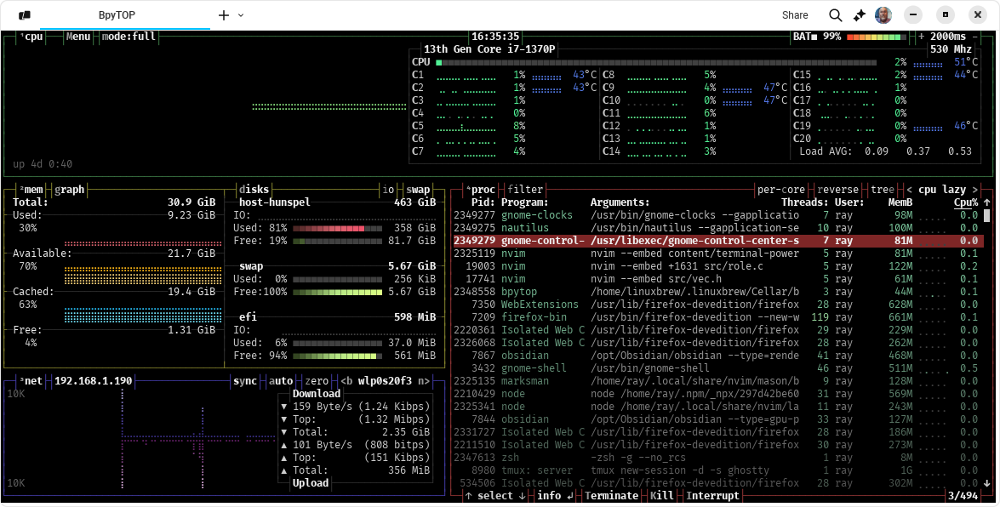

- btm

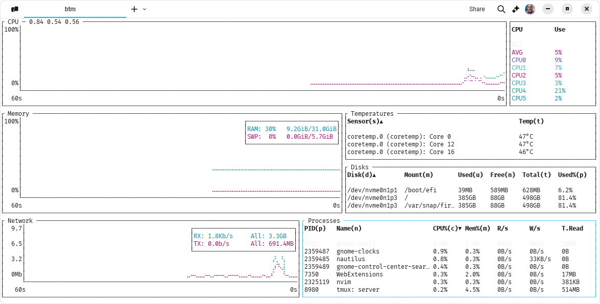

- gtop

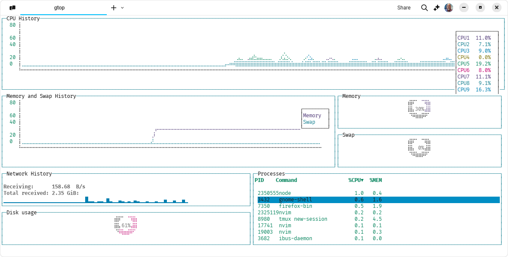

- htop

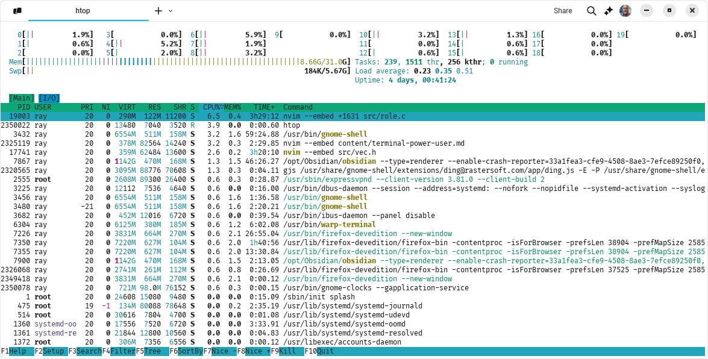

### lazygit

[lazygit](https://github.com/jesseduffield/lazygit/) is a TUI for `git`. It's
pretty full-featured. If you love the terminal and don't want to use a GUI, then
`lazygit` is really the way to go.

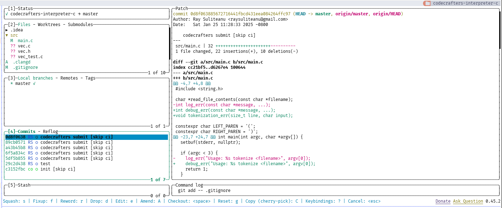

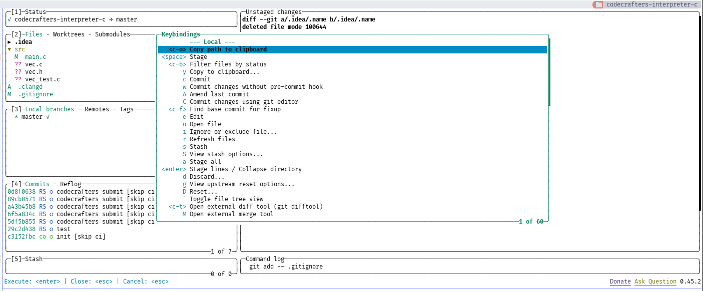

You can also use `lazygit` from within editors like `neovim`:

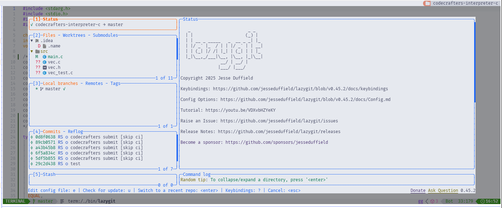

### dive

The last but not least tool for this blog is called [dive](https://github.com/wagoodman/dive).
`dive` is a tool for exploring a Docker image. Using a graphical interface, you
can view stats about an image, view each layer, navigate the filesystem tree,
see what was added each layer, and more. If you're trying to understand and
optimize your image, this is a great tool. And while it can be used interactively
as a TUI, it can also be used headless and integrated into your CI/CD pipeline.

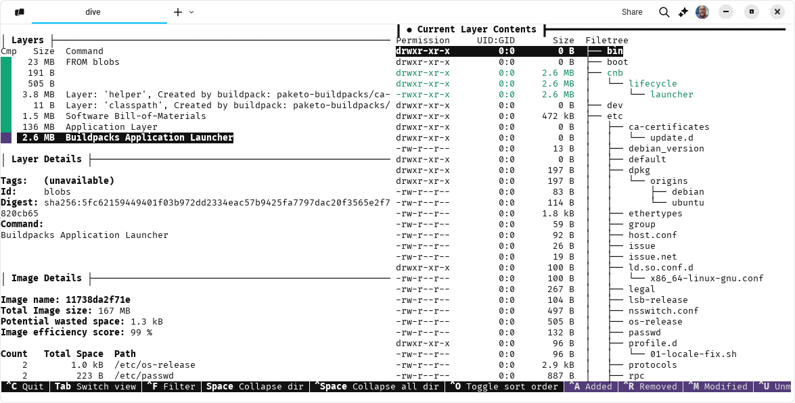

## Conclusion

I hope you liked this tour of what I consider some of the best terminal tools.
If you have additional ones you like, or ones you think are superior to the ones
I list here, for the given purpose, please let me know. I'm always looking for
ways to improve my workflow.
